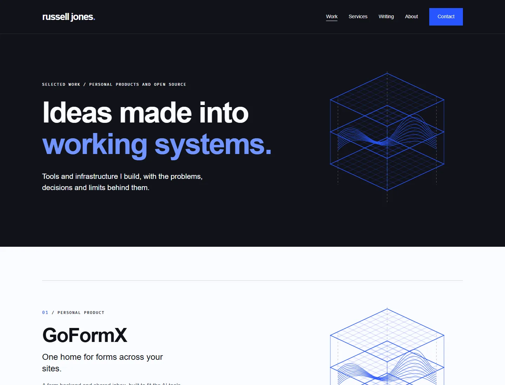
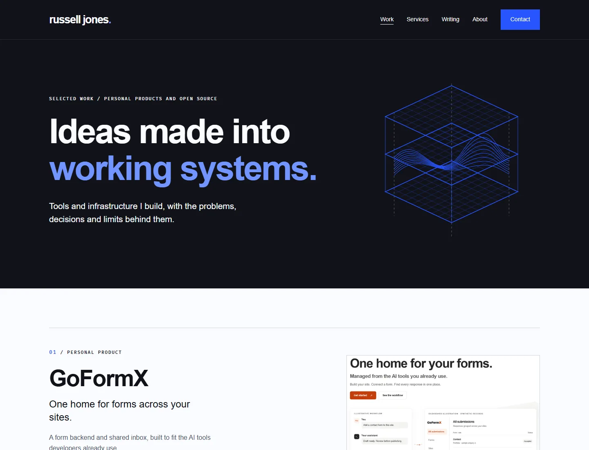
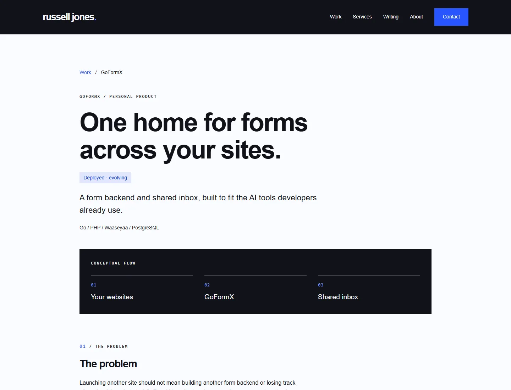
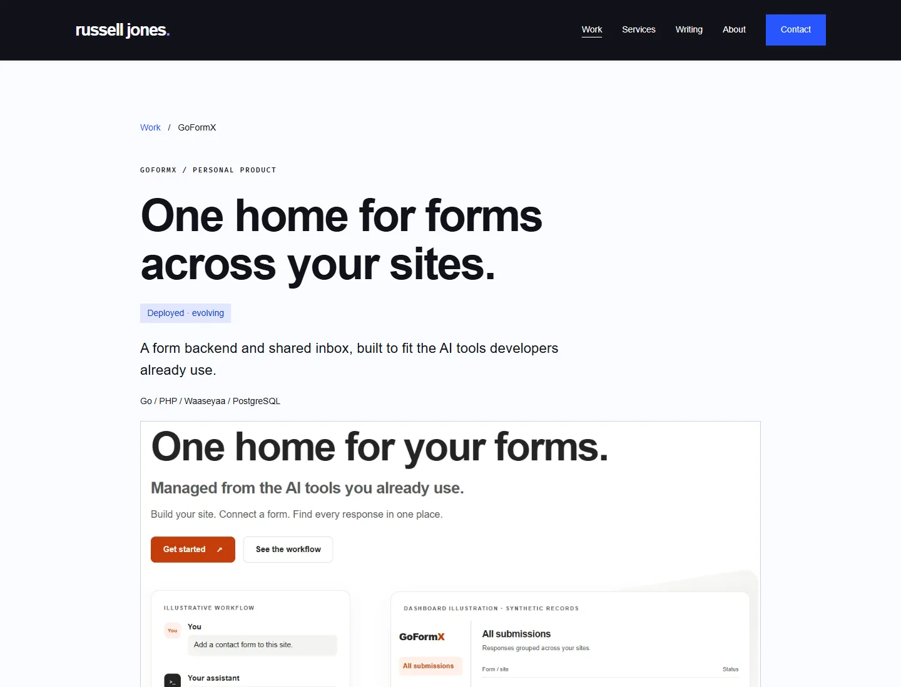
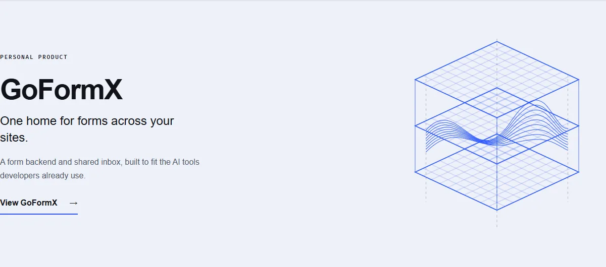
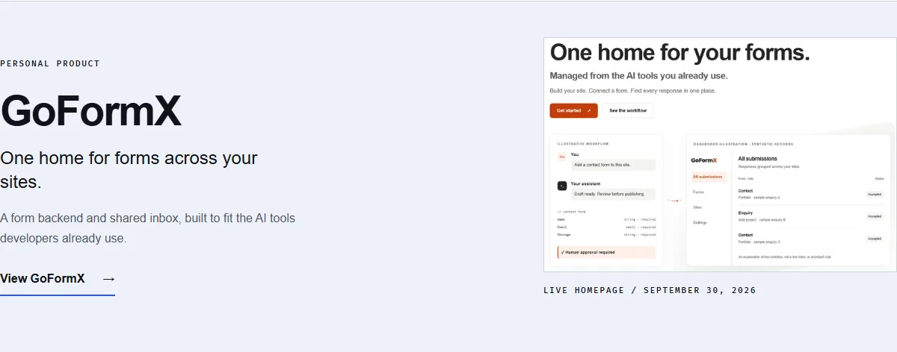

# GoFormX live screenshot review

Captured September 30, 2026 from https://www.goformx.com/ using Chromium at a 1440 × 1100 CSS-pixel viewport. The screenshot is of the live public homepage, not a mockup or the authenticated inbox. Its synthetic-record labels remain visible.

Crop: left 100, top 195, right 1340, bottom 1020. Result: 1240 × 825. Pillow Lanczos resizing, WebP quality 86/method 6, no metadata. Responsive widths: 480, 640, 960, 1240 (13,112 / 19,518 / 36,448 / 52,322 bytes). The dated filenames keep this capture distinct from a future update.

A shared linked figure supplies descriptive alt text, intrinsic dimensions, responsive srcset/sizes and the SvelteKit base path. Work and homepage previews load lazily; the case-study image loads eagerly. The image links to https://www.goformx.com/. Waaseyaa/North Cloud art and the generic hero illustration are unchanged.

Before/after evidence was captured on the production build under `/me` at 1440 × 1100 and 375 × 812. Full-page mobile captures include all page content; desktop captures use the viewport except the homepage evidence, which isolates its GoFormX row. Review files are optimized WebP copies of the PNG captures.

| View | Before | After |
| --- | --- | --- |
| Work desktop |  |  |
| Case study desktop |  |  |
| Homepage selected work desktop |  |  |

Mobile: [Work before](work-before-mobile.webp), [Work after](work-after-mobile.webp), [case study before](case-before-mobile.webp), [case study after](case-after-mobile.webp), [home work before](home-before-mobile.webp), [home work after](home-after-mobile.webp).

Verification: Svelte autofixer returns no issues/suggestions on all changed components; type checking, lint, production `/me` build, 162 unit tests, Chromium/WebKit project tests and release checks. Browser tests verify image decoding, links, every responsive file's HTTP 200/image MIME type, base-path URLs, mobile overflow, accessibility and 200% scaling. See PR for final run results. No merge or deployment is authorized.
